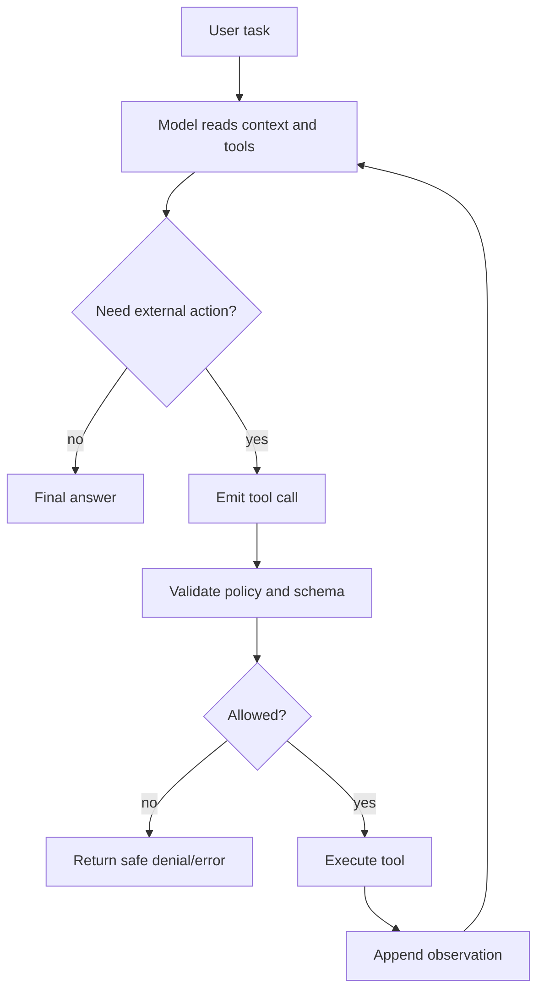

# How AI Agents Use Tools: From Function Calls to Reliable Tool Loops

Modern AI agents are language models wrapped in a harness that lets them inspect state, call external functions, observe results, and continue until a task is complete. The model supplies judgment and language understanding; tools supply contact with the world.

This distinction matters. A plain chatbot can explain how to check a pull request. An agent can inspect the pull request, run tests, search documentation, create a patch, and report the result. Tool use is the mechanism that turns a model from a text generator into an operator.

This article explains the practical mechanics: function calling, how models decide to call tools, common tool patterns, ReAct-style loops, orchestration, retries, observability, and security boundaries. The target reader is a developer who understands LLMs but has not built production agents yet.

## 1. What Is Tool Calling?

Tool calling, sometimes called function calling, is a structured contract between a model and the application around it.

The developer defines tools as named operations with descriptions and input schemas. The model receives those definitions in context. When the model decides a tool would help, it emits a structured tool request instead of normal prose. The application validates the request, executes the real function, and sends the result back to the model.

A minimal tool definition has four parts:

- A stable name, such as `search_docs`
- A natural-language description of when to use it
- A JSON-like input schema
- An executor function owned by the application, not the model

The model does not magically access your database or shell. It requests a call. Your harness decides whether that request is valid and safe to execute.

Here is a small Python example of the pattern:

```python
from dataclasses import dataclass
from typing import Callable, Any

@dataclass
class Tool:
    name: str
    description: str
    schema: dict[str, Any]
    call: Callable[[dict[str, Any]], dict[str, Any]]

def get_order_status(args: dict[str, Any]) -> dict[str, Any]:
    order_id = str(args["order_id"])
    # Real implementation would query a database or service.
    return {"order_id": order_id, "status": "shipped"}

tools = [
    Tool(
        name="get_order_status",
        description="Look up shipping status for one customer order ID.",
        schema={
            "type": "object",
            "properties": {"order_id": {"type": "string"}},
            "required": ["order_id"],
        },
        call=get_order_status,
    )
]
```

In production, the model-facing schema is only one layer. The executor still needs normal server-side validation, authorization, rate limits, audit logs, and error handling.

## 2. How Models Decide When to Use Tools

Models choose tools from context. The most important inputs are:

- The user's request
- The system/developer instructions
- Tool names and descriptions
- Tool schemas
- Examples or previous tool results
- The model's confidence that it can answer without external state

Good tool design is therefore prompt design plus API design. If a tool description is vague, the model may overuse it. If two tools overlap heavily, the model may choose the wrong one. If the schema allows broad strings like `query`, the model may pack unsafe instructions into it unless the harness validates intent.

For example, these two descriptions produce different behavior:

```text
Bad: search(query) - Search things.

Better: search_public_docs(query) - Search public product documentation.
Use only for current API syntax, configuration options, and migration notes.
Do not use for private data, customer records, or secrets.
```

The second version tells the model what the tool is for and what it is not for. That is a real control, not just documentation.

## 3. Common Tool Patterns

### Search and Retrieval

Search tools fetch external or private knowledge. Examples include web search, vector search, documentation lookup, CRM search, and codebase search.

Use retrieval when the model needs facts that may be current, lengthy, proprietary, or too specific to memorize.

Failure modes:

- Returning irrelevant context
- Using stale snippets
- Pulling sensitive records into model context
- Treating search snippets as verified truth

Mitigations:

- Scope retrieval by tenant, customer, project, or repository
- Return source URLs and timestamps
- Prefer authoritative sources
- Make the model cite or summarize evidence instead of copying blindly

### Code Execution

Code tools let an agent run tests, transform files, analyze data, or simulate behavior.

These tools are powerful because they turn guesses into measurements. They are dangerous because arbitrary execution can damage systems or expose secrets.

Typical controls:

- Run in a sandbox or container
- Restrict filesystem access
- Set CPU, memory, and wall-clock limits
- Block network access unless needed
- Redact secrets from stdout/stderr
- Require explicit approval for destructive commands

### API Actions

API tools create real-world effects: sending email, charging a card, deploying software, creating issues, posting messages, or placing bids.

Treat action tools differently from read tools. Reads can often be retried safely. Writes need idempotency keys, authorization checks, audit records, and clear rollback behavior.

For example:

```python
def send_invoice(args: dict[str, Any]) -> dict[str, Any]:
    customer_id = validate_customer(args["customer_id"])
    amount_cents = validate_amount(args["amount_cents"])
    idempotency_key = validate_uuid(args["idempotency_key"])

    require_approval(
        actor="agent",
        effect="payment_request",
        customer_id=customer_id,
        max_amount_cents=amount_cents,
    )

    return billing_api.create_invoice(
        customer_id=customer_id,
        amount_cents=amount_cents,
        idempotency_key=idempotency_key,
    )
```

The model can propose the action. The application decides whether the action is allowed.

## 4. ReAct and the Tool Loop

The ReAct pattern, introduced in the paper "ReAct: Synergizing Reasoning and Acting in Language Models," combines reasoning and action in an iterative loop. The model reasons about the task, chooses an action, observes the result, updates its plan, and continues.

In implementation terms, a tool loop usually looks like this:



A simple loop in Python:

```python
MAX_STEPS = 8

def run_agent(model, messages, tools):
    for step in range(MAX_STEPS):
        response = model.respond(messages=messages, tools=tool_schemas(tools))

        if response.final_text:
            return response.final_text

        for call in response.tool_calls:
            tool = tools[call.name]
            args = validate(tool.schema, call.arguments)
            result = tool.call(args)
            messages.append({
                "role": "tool",
                "tool_call_id": call.id,
                "content": result,
            })

    raise RuntimeError("agent_step_limit_exceeded")
```

The step limit is not optional. Without it, a confused model can loop forever, hammer an API, or burn budget.

## 5. Orchestration: The Harness Is the Product

The harness is everything around the model:

- Tool registry
- Prompt and instructions
- Memory and retrieval
- State machine
- Permissions
- Retry policy
- Human approval flow
- Logging and tracing
- Cost limits
- Final-response rules

Frameworks like LangChain describe an agent as a model that calls tools in a loop, with the harness managing the loop and context. This is a useful mental model: the model is not the whole agent. The production system around it is what makes it reliable.

For a serious agent, encode workflow state outside the model. For example:

```python
class TicketState:
    PLANNING = "planning"
    WAITING_FOR_APPROVAL = "waiting_for_approval"
    EXECUTING = "executing"
    VERIFYING = "verifying"
    DONE = "done"
    BLOCKED = "blocked"
```

Do not rely on the model to remember whether payment was approved, whether a customer opted out, or whether a deployment already happened. Store that in durable state.

## 6. Error Handling and Retries

Tools fail constantly. APIs time out. Search returns junk. Shell commands exit non-zero. Users provide incomplete data. The model must see failures as observations, but the harness must decide what can be retried.

A practical retry policy separates outcomes:

- Explicit failure: retry only if the error is transient
- Validation failure: do not retry without changing input
- Ambiguous result: do not replay a write until reconciled
- Success: record receipt and stop

For write operations, ambiguous results are the hardest case. Suppose an email API times out after accepting the message. Retrying may send a duplicate. The correct pattern is:

1. Use an idempotency key.
2. Store the outbound intent before calling the provider.
3. If the provider response is ambiguous, mark the record for reconciliation.
4. Check provider status before retrying.

The model should not be allowed to reason, "It probably failed, try again," for irreversible writes.

## 7. Security Considerations

Tool-using agents expand the attack surface. The model can be manipulated by prompts, retrieved content, web pages, emails, documents, tool outputs, and even error messages.

Key risks:

- Prompt injection from untrusted content
- Tool over-permission
- Data exfiltration through tool arguments
- SSRF and internal network access
- Shell injection
- Duplicate or unauthorized writes
- Secret leakage in logs
- Cross-tenant retrieval

Controls:

- Separate read tools from write tools
- Apply authorization in code, not only in prompts
- Validate schemas server-side
- Use allowlists for domains, recipients, chains, and accounts
- Redact secrets before model-visible output
- Log action intent, approval, provider receipt, and result
- Require human approval for financial, legal, public, or irreversible effects
- Deny by default when state is uncertain

A good rule: if the same API call would require a permission check in a normal web app, it still requires that permission check when the caller is an AI agent.

## 8. Practical Example: A Documentation-Research Agent

Imagine an agent that writes a migration guide for a software team.

Tools:

- `search_docs(query, library)`
- `read_url(url)`
- `run_code(command)`
- `create_markdown_file(path, content)`

Workflow:

1. Clarify target version and framework.
2. Search official docs.
3. Read current migration notes.
4. Create a minimal repro or code sample.
5. Run the sample.
6. Write the guide with citations.
7. Verify links and commands.

The critical design choice is not the model. It is the boundary around each tool:

- `search_docs` is read-only.
- `run_code` has no network and a temporary filesystem.
- `create_markdown_file` can write only under an approved workspace path.
- External publishing is a separate action requiring approval.

That boundary lets the agent work quickly without turning every mistake into an incident.

## 9. What Production Teams Should Measure

Useful metrics:

- Tool-call success rate
- Invalid tool-call rate
- Average tool calls per task
- Cost per completed task
- Retry count by tool
- Ambiguous write count
- Human-approval rate
- Completion rate after approval
- Incident rate by tool
- Latency per loop step

Trace everything. A failed agent run should show the model request, tool arguments, validation decision, execution result, and final state. Without traces, debugging agents becomes folklore.

## 10. Design Principles

1. Tools are capabilities, not suggestions.
2. The model proposes; the harness authorizes.
3. Durable state beats model memory.
4. Reads and writes need different safety rules.
5. Ambiguous writes require reconciliation, not optimism.
6. Tool descriptions are part of the interface.
7. Step limits and budgets are reliability features.
8. The best agents are boring around money, secrets, and public actions.

## Conclusion

AI agents use tools by turning language-model intent into structured, validated operations. Function calling provides the request format. ReAct-style loops provide the iterative reasoning pattern. The harness provides the real reliability: state, permissions, retries, logging, and security.

The practical path is to start with narrow read-only tools, add durable state and traces, then introduce write tools behind explicit authorization and idempotency. That architecture lets an agent do useful work without pretending the model is a secure runtime.

## Sources and Further Reading

- Shunyu Yao et al., "ReAct: Synergizing Reasoning and Acting in Language Models" - https://arxiv.org/abs/2210.03629
- Anthropic documentation, "Tool use with Claude" - https://platform.claude.com/docs/en/agents-and-tools/tool-use/overview
- LangChain documentation, "Agents" - https://docs.langchain.com/oss/python/langchain/agents
- LangChain documentation, "Tools" - https://docs.langchain.com/oss/python/langchain/tools
- Google Research blog, "ReAct: Synergizing Reasoning and Acting in Language Models" - https://research.google/blog/react-synergizing-reasoning-and-acting-in-language-models/
